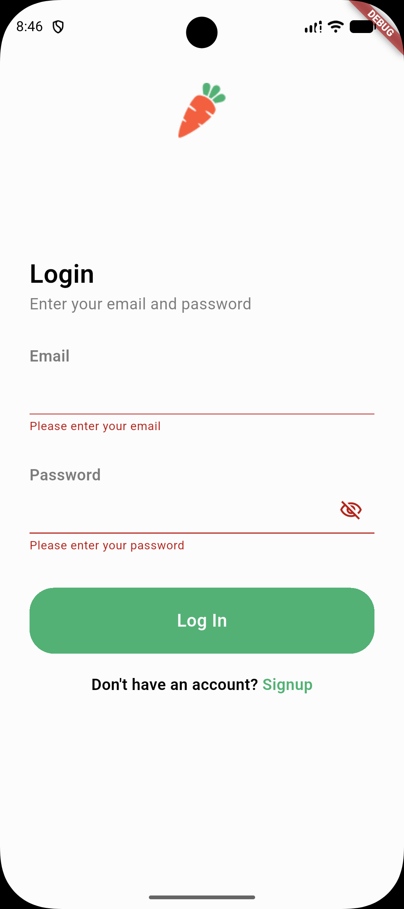
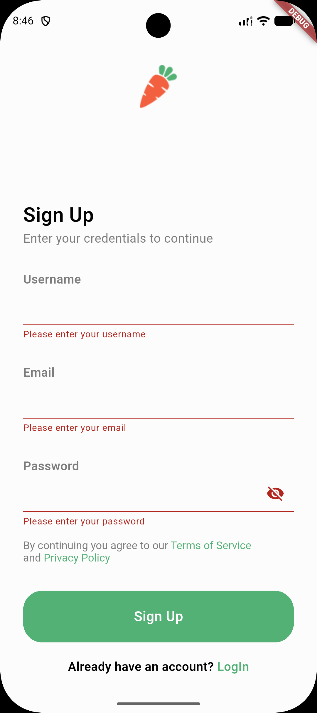
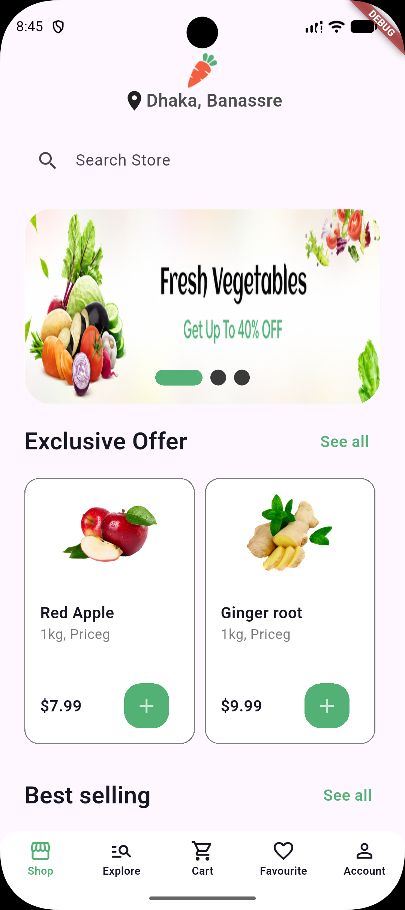
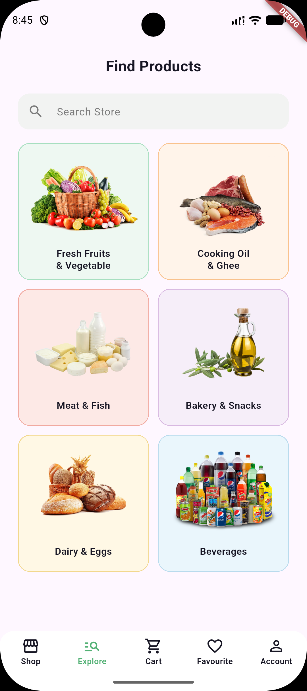
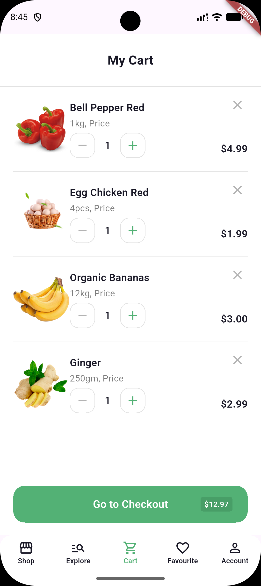
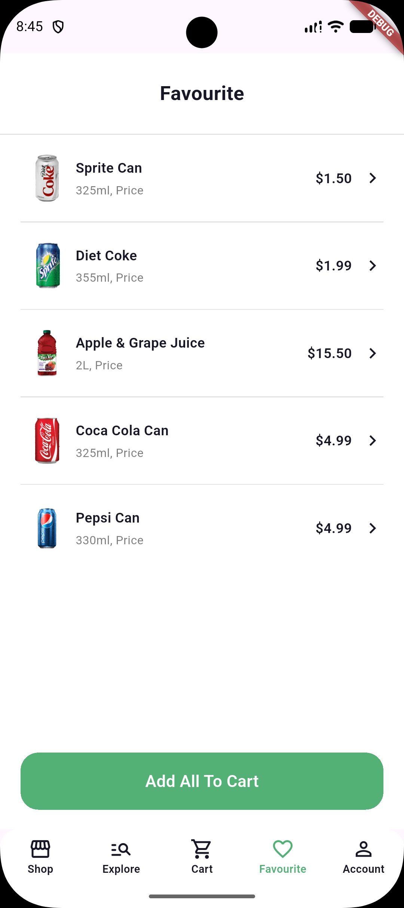
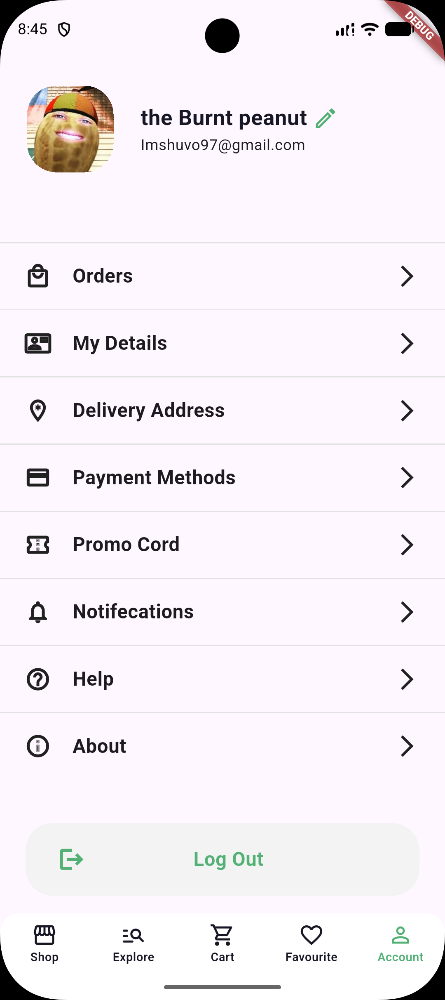
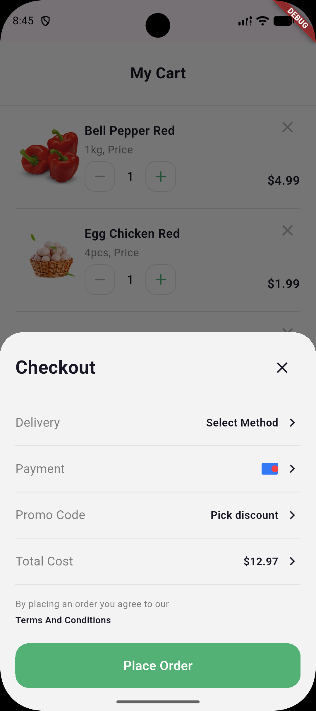
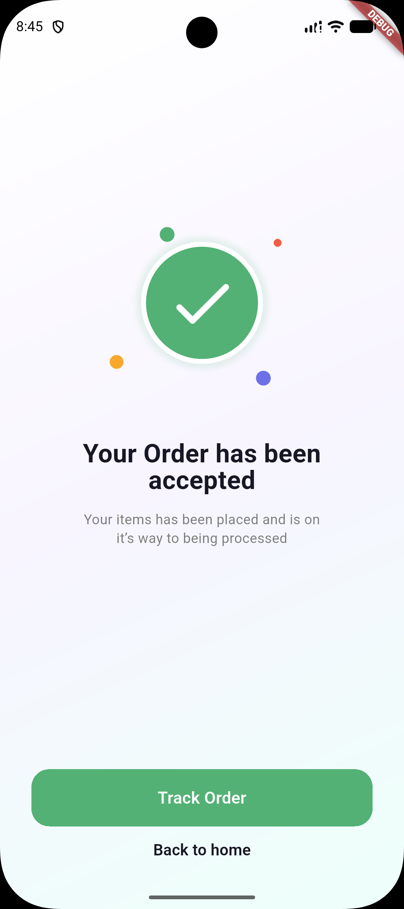

# FreshCart

FreshCart is a Flutter grocery-shopping application that makes it easy to discover products, manage a basket, save favourites, and complete an order through a clear mobile-first checkout flow.

The interface uses a clean white layout, focused product imagery, and a consistent green action colour to keep browsing and purchasing simple and approachable.

## Screenshots

The following captures show the complete primary user journey, from first launch and account access to product discovery, basket management, and checkout.

### First launch and account access

<p align="center">
  
  
  
  
</p>

### Browse and manage groceries

<p align="center">
  
  
  
  
  
</p>

### Checkout and confirmation

<p align="center">
  
  
</p>

## Core features

- **Authentication experience** — onboarding, sign-up, and sign-in screens with form validation and password visibility controls.
- **Shop home** — promotional carousel, exclusive offers, best-selling products, and reusable product cards.
- **Explore catalogue** — category browsing, a dedicated Beverages catalogue, product search, and selectable category and brand filters.
- **Persistent tab navigation** — direct access to Shop, Explore, Cart, Favourite, and Account areas from the bottom navigation bar.
- **Cart management** — item quantities can be increased or decreased, products can be removed, and the order total updates automatically.
- **Favourites** — a concise saved-products list with pricing and an “Add All To Cart” action.
- **Checkout journey** — a checkout summary sheet with delivery, payment, promotion, and total-cost rows; placing an order leads to a confirmation screen.
- **Order states** — polished order-accepted and order-failed interfaces, ready to connect to a payment or order-processing service.

## Checkout flow

1. Open **Cart** and select **Go to Checkout**.
2. Review delivery, payment, promotional discount, and the calculated total.
3. Select **Place Order** to view the order-accepted confirmation screen.
4. The included failed-order dialog can be presented when payment or fulfilment returns an error.

## Technology

- [Flutter](https://flutter.dev/) and Dart
- Material Design widgets and responsive layouts
- Local image assets for grocery products and promotional content
- `carousel_slider` and `smooth_page_indicator` for home-screen promotions

## Getting started

### Prerequisites

- Flutter SDK (stable channel)
- A device, emulator, or browser supported by Flutter

### Run locally

```bash
flutter pub get
flutter run
```

## Project structure

```text
lib/
├── models/                 # Product, category, and cart data models
├── screens/
│   ├── auth/               # Onboarding and authentication screens
│   ├── main_screens/       # Shop, Explore, Cart, Favourite, and checkout UI
│   └── product_detail/     # Individual product details
└── widgets/                # Reusable UI components
```

## Future improvements

- Connect authentication, catalogue, cart, and checkout data to a backend.
- Persist saved favourites and cart contents between sessions.
- Integrate delivery and payment providers.
- Add automated widget and integration tests for the purchase journey.
